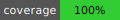

# Leser Digital Backend
Express application using TypeScript, [Prisma](https://www.prisma.io/), [GraphQL](https://graphql.org/), [Nexus](https://nexusjs.org/) and [Postgres](https://www.postgresql.org/)



**For more detailed documentation and info check the [Wiki](https://github.com/ludwigschub/leser-digital-backend/wiki).**

## Installation

```
yarn
```

## Environment

Run [Postgres](https://www.postgresql.org/), create a database and update the `DATABASE_URL` environment parameter accordingly.

Then run the prisma migrations:
```
yarn prisma migrate dev
```

And generate schema artifacts (e.g for nexus)
```
yarn prisma generate
```

## Testing

First, seed the database:
```
yarn seed
```

Then run the tests:
```
yarn test
```

## Schema File Structure

```
- src
  - graphql
    - schemas
      - [TYPE]
        - [TYPE].mutations.ts
        - [TYPE].queries.ts
        - [TYPE].permissions.ts
        - [TYPE].type.ts
        - [TYPE].test.ts
```
After adding a new type, update [`src/graphql/schemas/index.ts`](https://github.com/ludwigschub/fullstack-backend-template/blob/main/src/graphql/schemas/index.ts) and [`src/permission.ts`](https://github.com/ludwigschub/fullstack-backend-template/blob/main/src/graphql/permission.ts) for it's permissions.
